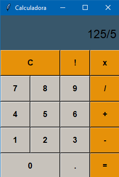

# Calculadora
> Projeto de uma calculadora com 5 funções básicas

Projeto de uma calculadora básica com 5 funções matemáticas básicas, como: soma, subtração, divisão, multiplicação e fatorial. Além disso, tem também a função CLEAR ou limpar, que serve para resetar os valores.

---
## Módulos
Foi utilizado o Tkinter para fazer a interface gráfica da calculadora.
Tkinter: `pip install tkinter`